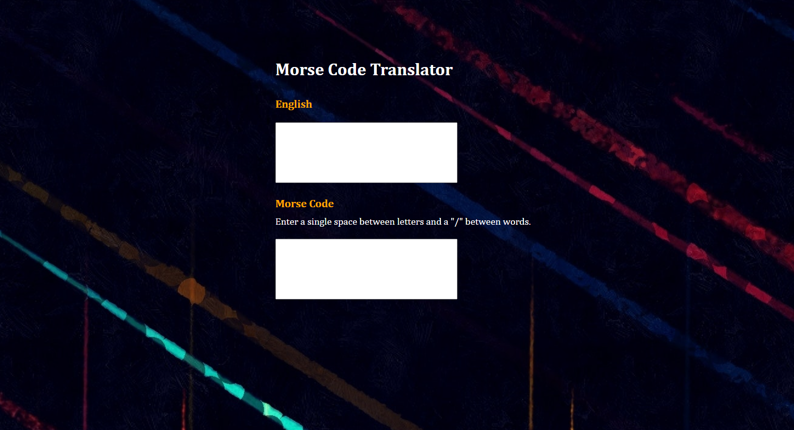

# Morse Code Translator

### A morse code translator built with HTML, SCSS and JavaScript, using an OOP approach.

#### Project Link [_here_](https://aimeejenner.github.io/morse-code-translator/).

<p align="center">
  
</p>

## Description

This translator app allows users to translate words or phrases from English to Morse Code and from Morse Code to English.

---

| Table of Contents               |
| ------------------------------- |
| [User Story](#UserStory)        |
| [Functionality](#Functionality) |
| [Technology](#Technology)       | 
| [Testing](#Testing)             |

---

## User Story

-   **As a user I would like to translate words and phrases from English to Morse Code and from Morse Code to English**
-   Given that I type an English word into the 'English' input box, the Morse Code translation should appear in the 'Morse Code' input box.
-   Given that I type an English phrase into the 'English' input box, the Morse Code translation should appear in the 'Morse Code' input box.
-   Given that I type a Morse Code word into the 'Morse Code' input box and the letters are separated by spaces, the English translation should appear in the 'English' input box.
-   Given that I type a Morse Code phrase into the 'Morse Code' input box and the words are separated by "/", the English translation should appear in the 'English' input box. 

## Functionality

The translator.js file contains three classes:

1. An overall Translator class with splitWords and joinWords methods attached. These methods are used by both translators.

```js
/*
The Translator class contains methods common to both translators
*/
class Translator {
    constructor(input, splitter, joiner) {
        this.input = input;
        this.splitter = splitter;
        this.joiner = joiner;
    }

    splitWords() {
        return this.input.split(this.splitter);
    }

    joinWords() {
        return this.translateWords().join(this.joiner);
    }
}
```

2. An EnglishToMorse class which extends the Translator class and has a translateWords method attached.

```js
/*
The EnglishToMorse class contains the method for translating from English to Morse Code
*/
class EnglishToMorse extends Translator {
    constructor(input, splitter = " ", joiner="/") {
        super(input, splitter, joiner);
        this.dictionary = {
            "A" : ".-", "B" : "-...", "C" : "-.-.", "D" : "-..",
            "E" : ".", "F" : "..-.", "G" : "--.", "H" : "....",
            "I" : "..", "J" : ".---", "K" : "-.-", "L" : ".-..",
            "M" : "--", "N" : "-.", "O" : "---", "P" : ".--.",
            "Q" : "--.-", "R" : ".-.", "S" : "...", "T" : "-",
            "U" : "..-", "V" : "...-", "W" : ".--", "X" : "-..-",
            "Y" : "-.--", "Z" : "--.."
        }
    }

    translateWords() {
        return this.splitWords().map(word => word
            .toUpperCase()
            .split("")
            .map(letter => this.dictionary[letter])
            .join(" ")
        );
    }
}
```

3. A MorseToEnglish class which extends the Translator class and has a translateWords method attached.

```js
/*
The MorseToEnglish class contains the method for translating from Morse Code to English
*/
class MorseToEnglish extends Translator {
    constructor(input, splitter="/", joiner=" ") {
        super(input, splitter, joiner);
        this.dictionary = {
            ".-" : "A", "-..." : "B", "-.-." : "C", "-.." : "D",
            "." : "E", "..-." : "F", "--." : "G", "...." : "H",
            ".." : "I", ".---" : "J", "-.-" : "K", ".-.." : "L",
            "--" : "M", "-." : "N", "---" : "O", ".--." : "P",
            "--.-" : "Q", ".-." : "R", "..." : "S", "-" : "T",
            "..-" : "U", "...-" : "V", ".--" : "W", "-..-" : "X",
            "-.--" : "Y", "--.." : "Z"
        }
    }

    translateWords() {
        return this.splitWords().map(word => word
            .split(" ")
            .map(letter => this.dictionary[letter])
            .join("")
        );      
    }
}
```
The EnglishToMorse and MorseToEnglish translators are imported into the main.js file. Event listeners are attached to the 'English' and 'Morse Code' input boxes, which allows a new instance of either the EnglishToMorse or MorseToEnglish class to be created whenever the user input changes.

## Technology

-   Javascript
-   Sass
-   HTML5

## Testing

The translator.test.js file contains tests which can be run to check that the EnglishToMorse and MorseToEnglish translators are working correctly.